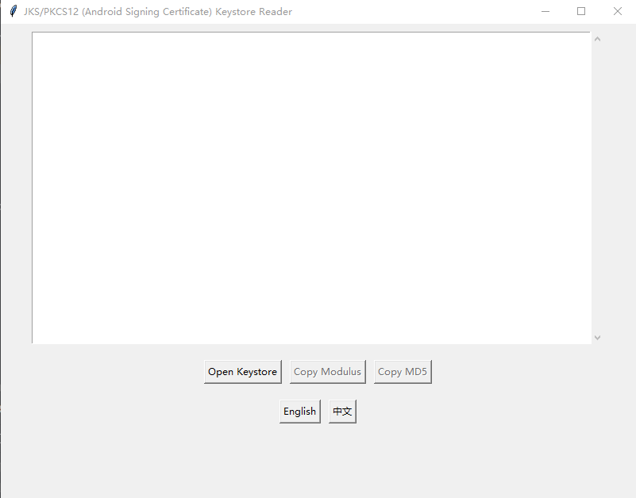
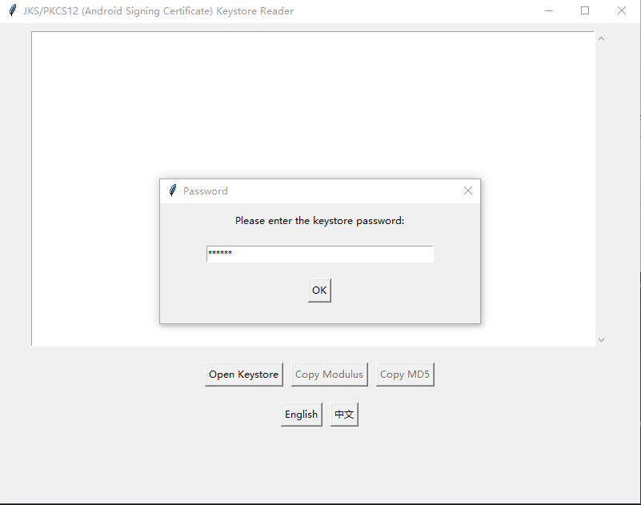

---

# JKS/PKCS12 Keystore Reader


A Python-based GUI application for reading and inspecting Java KeyStore (JKS) and PKCS12 keystore files. This tool is designed to help developers, system administrators, and security professionals easily view certificate and key details, including fingerprints, public key information, and validity periods.

---

## Features

- **Supports JKS and PKCS12 Formats**: Automatically detects and parses both JKS and PKCS12 keystore files.
- **Certificate Details**:
  - Displays certificate version, serial number, subject, validity period, and signature algorithm.
  - Extracts public key details (e.g., modulus and exponent for RSA keys, curve type for EC keys).
  - Computes and displays certificate fingerprints (MD5, SHA1, SHA256).
- **User-Friendly Interface**:
  - Intuitive GUI built with `tkinter`.
  - Password-protected keystore access with a secure password dialog.
- **Clipboard Integration**:
  - Copy the modulus (for RSA keys) or MD5 fingerprint to the clipboard with a single click.
- **Multi-Language Support**:
  - Supports dynamic language switching (e.g., English and Chinese).
  - Language-specific text is stored in external JSON files for easy customization.
- **Error Handling**:
  - Provides clear error messages for unsupported formats, incorrect passwords, or corrupted files.

---

## Screenshots

  
*Main interface displaying certificate details.*

  
*Password dialog for secure keystore access.*

---

## Installation

1. **Clone the Repository**:
   ```bash
   git clone https://github.com/seven-cm/jks-pkcs12-reader.git
   cd jks-pkcs12-reader
   ```

2. **Install Dependencies**:
   ```bash
   pip install -r requirements.txt
   ```

3. **Run the Application**:
   ```bash
   python main.py
   ```

---

## Usage

1. **Open a Keystore File**:
   - Click the "Open Keystore" button and select a JKS or PKCS12 file.
   - Enter the keystore password when prompted.

2. **View Certificate Details**:
   - The application will display detailed information about the certificates and keys in the keystore.

3. **Copy Data to Clipboard**:
   - Use the "Copy Modulus" or "Copy MD5" buttons to copy the respective data to the clipboard.

4. **Switch Languages**:
   - Use the language buttons (e.g., "English" or "中文") to switch the interface language.

---

## Supported Languages

- English (`lang_en.json`)
- Chinese (`lang_zh.json`)

To add a new language, create a JSON file (e.g., `lang_fr.json`) and follow the existing format.

---

## Dependencies

- Python 3.7+
- `tkinter` (included with Python)
- `cryptography` (`pip install cryptography`)
- `jks` (`pip install jks`)

---

## Contributing

Contributions are welcome! If you'd like to contribute, please follow these steps:

1. Fork the repository.
2. Create a new branch for your feature or bugfix.
3. Commit your changes and push to your branch.
4. Submit a pull request.

---

## License

This project is licensed under the MIT License. See the [LICENSE](LICENSE) file for details.

---

## Acknowledgments

- Built with the `cryptography` library for certificate parsing.
- Inspired by the need for a simple, cross-platform keystore inspection tool.

---


Feel free to customize this description further to match your project's specifics!